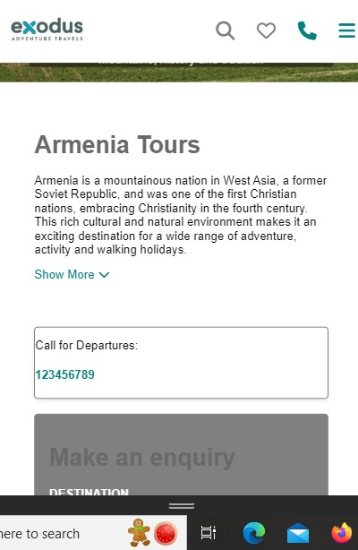

# Travelopia_Task

## Table of Contents

- [How to Start the App](#how-to-start-the-app)
- [Screenshots](#screenshots)
  - [Webpage](#web-page)
  - [Mobile Page](#mobile-page)
- [App Functionality](#app-functionality)
  - [Responsiveness](#responsiveness)
  - [Toggle Logic](#toggle-logic)
- [Tech Stack](#tech-stack)

## How to Start the App

To run the app locally, follow these steps:

1. Clone the repository:

   ```bash
   git clone https://github.com/GaneshYadav3142/Travelopia_Task.git

2. Move to index.html: 
   
   ```bash
    index.html

3. Install Necessary Dependencies: 

    ```bash
   npm install


    
   
## Screenshots

### Webpage


### Mobile Page




## App Functionality

1. These app is Fully Responsive to all Screens available:

2. Website page in which all tha content is as shown:


3. There is toggle option available for the Mobile Screen for Conent Hiding:


4. These App have the Jest Test case Written:


## Tech Stack

The app is built using the following technologies:

1. HTML:
2. CSS3:
3. JavaScript:
4. FontAwesome for Icons:
5. Jest
